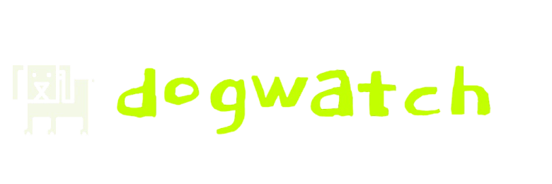

<p align="center">
  
</p>

<h3 align="center">eBPF-powered observability in a single binary</h3>

<p align="center">
  <a href="https://go.dev"></a>
  <a href="https://kernel.org"></a>
  <a href="LICENSE"></a>
</p>

---

Drop dogwatch on any Linux server. In 60 seconds you get distributed tracing, metrics, logs, alerting, and incidents — without touching a line of application code.

No agents. No SDKs. No YAML files. One binary, root, done.

## Quick Start

```bash
curl -fsSL https://raw.githubusercontent.com/1byteword/dogwatch/main/install.sh | sudo bash
sudo dogwatch
# Open http://localhost:9999
```

## What It Does

dogwatch uses eBPF to hook into kernel functions and automatically discover your infrastructure:

- **Traces every HTTP request** — inbound and outbound, with latency, status codes, and endpoints
- **Parses database protocols** — MySQL, PostgreSQL, and Redis queries captured at the wire level
- **Builds a service map** — auto-discovers which services talk to which, no config required
- **Captures CPU profiles** — flame graphs with profile-to-trace linking
- **Collects system metrics** — CPU, memory, disk, network, containers
- **Manages incidents** — alerting, on-call schedules, escalation policies, SLO tracking
- **Ingests OpenTelemetry** — OTLP gRPC (`:4317`) and HTTP (`:4318`) receivers built in

Everything stores in SQLite. No Postgres, no Redis, no Kafka. Just the binary and a data directory.

## Architecture

```
dogwatch (single binary)
├── eBPF probes          Kernel-level tracing (TCP, HTTP, SSL, DB protocols)
├── OTLP receiver        OpenTelemetry gRPC + HTTP ingestion
├── Aggregator           Metrics computation, percentiles, rates
├── SQLite storage       Metrics, traces, logs, incidents, SLOs
├── Evaluation engines   Alerts, SLOs, recording rules, escalations
├── PromQL engine        Grafana-compatible query API
└── Web UI               SolidJS dashboard on :9999
```

## How the eBPF Tracing Works

| Probe | What it captures |
|-------|-----------------|
| `kprobe/tcp_connect` | Outbound TCP connections |
| `kretprobe/inet_csk_accept` | Inbound TCP connections |
| `tracepoint/syscalls/sys_enter_write` | HTTP requests, DB queries |
| `tracepoint/syscalls/sys_exit_read` | HTTP responses, DB results |
| `perf_event` (49Hz) | CPU stack samples for flame graphs |
| `uprobe/SSL_write`, `SSL_read` | HTTPS/TLS traffic (OpenSSL) |

Zero instrumentation. Zero config. eBPF sees everything from the kernel.

## CLI Usage

```
sudo dogwatch [flags]

  -port int          Web UI port (default 9999)
  -data string       Data directory (default /var/lib/dogwatch)
  -v                 Verbose mode — show individual events
  -no-web            Disable web UI, terminal only
  -tls-cert string   TLS certificate file (enables HTTPS)
  -tls-key string    TLS private key file
  -otlp              Enable OTLP receivers (default true)
  -otlp-grpc-port    OTLP gRPC port (default 4317)
  -otlp-http-port    OTLP HTTP port (default 4318)
```

### Subcommands

```bash
# Run built-in analysis scripts
dogwatch run mysql/slow_queries
dogwatch run redis/hotkeys

# Migrate dashboards and alerts from other platforms
dogwatch migrate --from datadog --api-key $DD_API_KEY
dogwatch migrate --from grafana --url http://grafana:3000
```

### Federation

```bash
# Start a cluster (gossip-based, no coordinator)
sudo dogwatch --cluster --cluster-port 7946
sudo dogwatch --cluster --cluster-seeds 10.0.1.10:7946

# Each node is fully functional standalone.
# Federation adds cluster-wide incident sync and aggregated metrics.
```

## Requirements

- **Linux** kernel 5.8+ (for BPF ring buffers)
- **x86_64** or **ARM64**
- **Root** privileges (required for eBPF)
- Docker optional (for container metrics)

## Building from Source

```bash
git clone https://github.com/1byteword/dogwatch.git
cd dogwatch
make all        # builds UI + Go binary
sudo ./dogwatch
```

To rebuild just the Go binary:

```bash
CGO_ENABLED=0 go build -o dogwatch ./cmd/dogwatch
```

To regenerate eBPF bindings (requires clang + libbpf):

```bash
go generate ./internal/probe/...
```

## vs. Datadog / Grafana / New Relic

| | dogwatch | Datadog | Grafana stack |
|---|---|---|---|
| Setup | 1 binary, 60 seconds | Agent + config + SaaS | Prometheus + Grafana + Loki + Tempo + Alertmanager |
| Instrumentation | None (eBPF) | SDK per language | SDK per language |
| Data stays on your server | Yes | No | Yes |
| Cost | Free | Per host + per GB | Free (self-hosted) |
| Dependencies | None | SaaS | 5+ services |

## License

MIT

## Contributing

PRs welcome. See the [issues](https://github.com/1byteword/dogwatch/issues) page.
